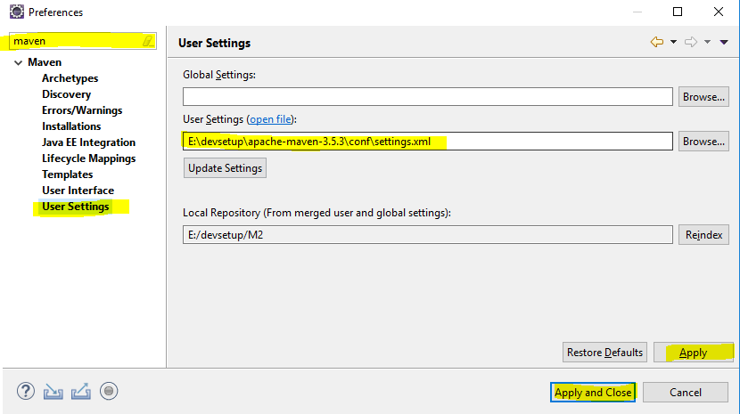
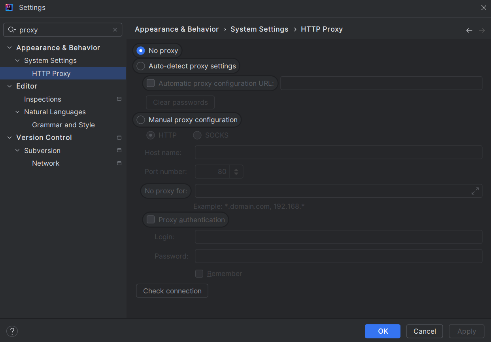

Para configurar um **proxy** no **Maven**, você precisa editar o arquivo `settings.xml` que está localizado no diretório de configuração do Maven. A configuração do proxy é útil quando você precisa acessar repositórios Maven por meio de uma rede que exige autenticação ou onde o acesso à internet é restrito.

### Passos para configurar o proxy no Maven:

1. **Localize o arquivo `settings.xml`:**
    - O arquivo `settings.xml` pode ser encontrado em dois lugares:
        - **No diretório de instalação do Maven**: `$MAVEN_HOME/conf/settings.xml`
        - **No diretório de configuração do usuário**: `~/.m2/settings.xml` (Linux/Mac) ou `C:\Users\<seu_usuario>\.m2\settings.xml` (Windows).
    - Se o arquivo `settings.xml` não existir no diretório `~/.m2`, você pode copiá-lo do diretório `$MAVEN_HOME/conf` para personalizá-lo.

2. **Editar o arquivo `settings.xml`:**
   Adicione ou edite a seção de proxy no arquivo `settings.xml`. A configuração deve ficar parecida com o seguinte exemplo:

   ```xml
   <proxies>
       <proxy>
           <id>proxy-example</id>
           <active>true</active>
           <protocol>http</protocol>
           <host>proxy.example.com</host>
           <port>8080</port>
           <username>proxyuser</username>  <!-- Caso precise de autenticação -->
           <password>somepassword</password> <!-- Caso precise de autenticação -->
           <nonProxyHosts>www.google.com|*.example.com</nonProxyHosts> <!-- Hosts que não usam proxy -->
       </proxy>
   </proxies>
   ```

   ### Detalhes dos campos:
    - `<id>`: Identificador do proxy. Pode ser qualquer nome.
    - `<active>`: Se o proxy estará ativo. Defina como `true` para ativá-lo.
    - `<protocol>`: O protocolo utilizado para o proxy. Pode ser `http` ou `https`.
    - `<host>`: O endereço do servidor proxy (exemplo: `proxy.example.com`).
    - `<port>`: A porta do servidor proxy (exemplo: `8080`).
    - `<username>` e `<password>`: Se o proxy exigir autenticação, coloque o nome de usuário e a senha aqui. Caso não precise de autenticação, esses campos podem ser omitidos.
    - `<nonProxyHosts>`: Lista de hosts ou domínios que não devem passar pelo proxy. Eles podem ser separados por `|` (pipe). Exemplo: `www.google.com|*.example.com`.

3. **Salvar o arquivo:**
   Após editar o arquivo `settings.xml`, salve-o.

4. **Verificar a configuração:**
   Para testar a configuração do proxy, você pode executar um comando Maven, como `mvn clean install`, e verificar se a conexão com os repositórios remotos está funcionando corretamente.

### Exemplo completo de um `settings.xml` com proxy configurado:
```xml
<settings xmlns="http://maven.apache.org/SETTINGS/1.0.0">
    <proxies>
        <proxy>
            <id>proxy-example</id>
            <active>true</active>
            <protocol>http</protocol>
            <host>proxy.example.com</host>
            <port>8080</port>
            <username>proxyuser</username>
            <password>somepassword</password>
            <nonProxyHosts>www.google.com|*.example.com</nonProxyHosts>
        </proxy>
    </proxies>
</settings>
```

Isso deve garantir que o Maven consiga se conectar à internet através do proxy configurado, especialmente ao acessar repositórios remotos para baixar dependências.

### Configuração no Eclipse:
1. Vá para `Window -> Preferences -> Maven -> User Settings`.
2. Selecione o arquivo `settings.xml` e clique em "Update Settings".



### Configuração no IntelliJ:
1. Vá para `File -> Settings -> Build, Execution, Deployment -> Build Tools -> Maven`.
2. Aponte para o arquivo `settings.xml` que contém as configurações do proxy.




### Linha de Comando:
Você também pode configurar o proxy diretamente na linha de comando:
```sh
mvn -DproxySet=true -DproxyHost=proxy.example.com -DproxyPort=8080 -DproxyUser=proxyuser -DproxyPassword=somepassword clean install
```

Essas configurações ajudarão o Maven a se conectar à internet através do proxy configurado[1](https://maven.apache.org/guides/mini/guide-proxies.html)[2](https://howtodoinjava.com/maven/maven-proxy-settings/).
