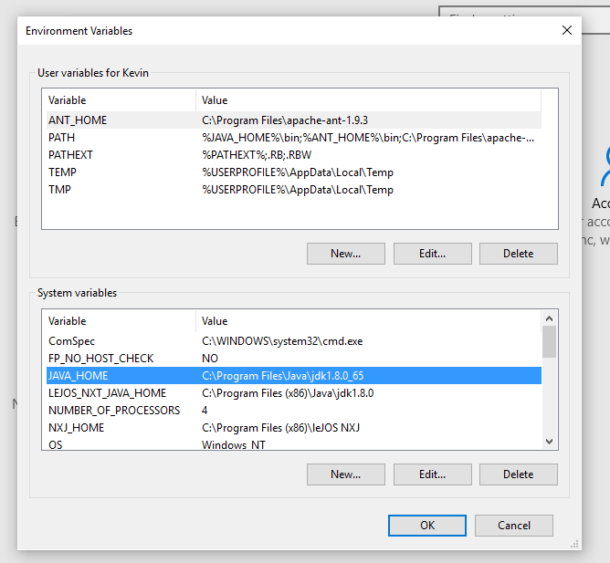

## Configurando as Variáveis de Ambiente Java e Maven no Windows

**Por que configurar as variáveis de ambiente?**

Ao configurar as variáveis de ambiente JAVA_HOME e MAVEN_HOME, você facilita o acesso do sistema operacional aos seus respectivos diretórios. Isso permite que ferramentas de linha de comando como o Maven encontrem automaticamente o JDK (Java Development Kit) e executem seus comandos sem a necessidade de especificar o caminho completo a cada vez.

**Pré-requisitos:**

* **[JDK (Java Development Kit)](https://www.oracle.com/br/java/technologies/downloads/archive/) instalado:** Certifique-se de ter baixado e instalado o JDK da Oracle ou de outra fonte confiável.
* **[Maven baixado e descompactado](https://maven.apache.org/download.cgi):** Faça o download do Maven e descompacte-o em um diretório de sua preferência.

**Passos para a configuração:**

1. **Acessar as configurações de variáveis de ambiente:**
    * Pressione a tecla do Windows + R para abrir a caixa de diálogo "Executar".
    * Digite "sysdm.cpl" e pressione Enter.
    * Na janela "Propriedades do Sistema", clique em "Variáveis de ambiente".
   

2. **Configurar a variável JAVA_HOME:**
    * Na seção "Variáveis do sistema", clique em "Novo".
    * Em "Nome da variável", digite: JAVA_HOME
    * Em "Valor da variável", cole o caminho completo do diretório onde o JDK está instalado (por exemplo, C:\Program Files\Java\jdk-17.0.2).
    * Clique em "OK".
   

3. **Configurar a variável MAVEN_HOME:**
    * Na seção "Variáveis do sistema", clique em "Novo".
    * Em "Nome da variável", digite: MAVEN_HOME
    * Em "Valor da variável", cole o caminho completo do diretório onde o Maven foi descompactado (por exemplo, C:\apache-maven-3.9.1).
    * Clique em "OK".

4. **Editar a variável PATH:**
    * Na seção "Variáveis do sistema", localize a variável PATH e clique em "Editar".
    * Clique em "Novo" e adicione os seguintes caminhos:
        * %JAVA_HOME%\bin
        * %MAVEN_HOME%\bin
    * Clique em "OK" em todas as janelas.

**Exemplo visual:**

[JAVA_HOME and MAVEN_HOME environment variables in Windows](https://stackoverflow.com/questions/34778325/setting-java-home-for-maven-on-windows-10)

**Verificando a configuração:**

* Abra um prompt de comando e digite: `java -version`
    * Se a configuração estiver correta, você verá informações sobre a versão do Java instalada.
* Digite: `mvn -version`
    * Se a configuração estiver correta, você verá informações sobre a versão do Maven instalada.

**Dicas:**

* **Reinicie o terminal:** Após configurar as variáveis de ambiente, é recomendado reiniciar o terminal para que as alterações tenham efeito.
* **Use o comando `setx`:** Para configurar as variáveis de ambiente de forma mais rápida, você pode usar o comando `setx` no prompt de comando. Por exemplo:
    * `setx JAVA_HOME "C:\Program Files\Java\jdk-17.0.2"`
    * `setx MAVEN_HOME "C:\apache-maven-3.9.1"`
* **Verifique a documentação:** Consulte a documentação oficial do Java e do Maven para obter informações mais detalhadas e específicas sobre a configuração em diferentes sistemas operacionais.

**Por que é importante configurar corretamente as variáveis de ambiente?**

* **Facilita o desenvolvimento:** Ao configurar as variáveis de ambiente, você pode executar comandos do Java e do Maven de qualquer diretório, sem precisar especificar o caminho completo para os executables.
* **Evita erros:** Uma configuração incorreta das variáveis de ambiente pode levar a erros durante a execução de projetos Java.
* **Padronização:** A configuração das variáveis de ambiente garante que todos os desenvolvedores de um projeto utilizem as mesmas versões do Java e do Maven, evitando problemas de compatibilidade.

Com as variáveis de ambiente configuradas corretamente, você estará pronto para iniciar seus projetos Java utilizando o Maven.
